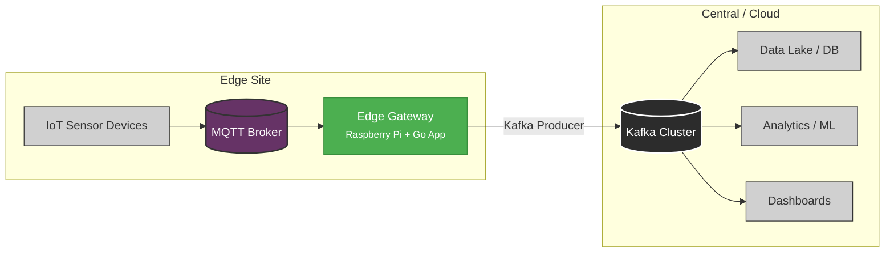

# 🌐 Intelligence at the Edge: IoT Data Aggregation & Processing Gateway

> **A robust edge computing gateway built on Raspberry Pi using Go**  
> This project implements intelligent, resilient data preprocessing at the network edge, reducing bandwidth, improving data quality, and enabling reliable telemetry flow from IoT sensors to cloud analytics via Kafka.

---

## 🔍 Project Overview

In modern IoT systems, sending raw sensor data directly to the cloud leads to **high bandwidth usage**, **latency bottlenecks**, and **increased operational costs**. This project solves that with an **intelligent edge gateway** running on a **Raspberry Pi**, written in **Go (Golang)** for performance, concurrency, and efficiency.

The gateway:
- 📥 **Ingests** real-time sensor data via **MQTT**
- 💾 **Buffers** data locally during network outages
- 🧹 **Filters, aggregates, and enriches** data at the edge
- 🚀 **Forwards cleansed, high-value data** to **Apache Kafka** for downstream analytics

By moving “intelligence” to the edge, this solution enables:
- ✅ Up to **98% reduction in data volume**
- ✅ **No data loss** during intermittent connectivity
- ✅ **Low-latency local processing**
- ✅ **Scalable integration** with real-time analytics, data lakes, or ML pipelines

Perfect for **industrial monitoring**, **smart environment systems**, or **remote sensing infrastructures**.

---

## 🧩 Key Features

✅ **MQTT Subscriber** – Real-time ingestion from IoT sensors using topics like `sensors/+/data`  
✅ **Resilient Local Buffering** – Disk-persistent SQLite queue ensures data survival during outages  
✅ **Configurable Data Processing** – Filter noise, aggregate values (e.g., avg temp per minute), enrich with metadata  
✅ **Kafka Producer Integration** – Reliable delivery to centralized Kafka cluster using `confluent-kafka-go`  
✅ **Fault-Tolerant Design** – Exponential backoff retry, automatic reconnection, message deduplication  
✅ **Lightweight & Efficient** – Built in Go: one static binary, minimal CPU/memory footprint  
✅ **YAML Configuration** – Human-readable, easily modifiable rules for topics, filters, thresholds, and intervals  
✅ **Structured Logging** – Logging with Zap for debugging and operations

---

## 🏗️ System Architecture

This gateway sits between local IoT devices and a centralized analytics backend:



### Why Edge Processing Matters

| Traditional Approach | ✅ This Gateway |
|----------------------|----------------|
| Sensors → Raw Data → Cloud → Process | Sensors → Clean/Agg Data → Cloud → Analytics |
| High bandwidth cost | Drastically reduced data flow |
| Sensitive to network issues | Local buffering ensures no data loss |
| Cloud bears full processing load | Edge handles filtering & aggregation |

Edge-first processing is **essential for scale, cost-efficiency, and reliability**.

---

## 🛠️ Tech Stack

| Layer            | Technology                                   |
|------------------|----------------------------------------------|
| **Hardware**     | Raspberry Pi 4/5 (ARM64), or any Linux device |
| **Language**     | Go (Golang) 1.21+                             |
| **MQTT Client**  | Eclipse Paho Go MQTT                          |
| **Kafka Client** | Confluent Kafka Go (`confluent-kafka-go`)     |
| **Storage**      | SQLite (disk-backed buffering)                |
| **Config**       | YAML + Viper                                  |
| **Logging**      | Zap (structured, leveled logging)             |
| **Build Tool**   | Makefile + Go modules                         |
| **Deployment**   | systemd service (recommended), or `nohup`     |

  
  
  
  


---

## 🚀 Getting Started

### Prerequisites

- ✅ Raspberry Pi (4 or 5 recommended) with Raspberry Pi OS Lite
- ✅ Go 1.21+ installed (`go version`)
- ✅ Local MQTT broker (e.g., Mosquitto)
- ✅ Access to Kafka cluster (local or remote)
- ✅ Basic Linux command-line skills

---

### 1. Clone the Repository

```bash
git clone https://github.com/your-username/intelligence-at-the-edge.git
cd intelligence-at-the-edge
```

---

### 2. Install Dependencies

```bash
go mod tidy
```

---

### 3. Configure the Gateway

Edit `config/config.yaml` to match your environment:

```yaml
mqtt:
  broker: "tcp://192.168.1.100:1883"
  client_id: "edge-gateway-01"
  topic: "sensors/#"
  qos: 1

kafka:
  brokers:
    - "kafka1.internal:9092"
    - "kafka2.internal:9092"
  topic: "iot-sensor-data"
  client_id: "edge-producer"

buffer:
  path: "./data/buffer.db"
  max_size_mb: 100
  flush_interval_seconds: 30

processing:
  aggregation_window_seconds: 60
  rules:
    - type: "filter"
      field: "temperature"
      operator: "<"
      value: -50
      action: "drop"
    - type: "filter"
      field: "temperature"
      operator: ">"
      value: 100
      action: "drop"
    - type: "aggregate"
      field: "temperature"
      function: "average"
      output_name: "avg_temp"
    - type: "aggregate"
      field: "humidity"
      function: "avg"
      output_name: "avg_humidity"

logging:
  level: "info"
  output: "file"
  file: "./logs/gateway.log"
```

> 💡 Tip: This config filters out physically impossible temperatures and emits one aggregated message per minute instead of raw per-second readings.

---

### 4. Build the Binary

```bash
make build
```

> If you don’t have `make`, use:  
> `go build -o bin/edge-gateway cmd/gateway/main.go`

---

### 5. Run the Gateway

#### Option A: Manual Run (Testing)

```bash
./bin/edge-gateway --config config/config.yaml
```

Press `Ctrl+C` to stop.

#### Option B: Run as Systemd Service (Production)

```bash
sudo make install-service
sudo systemctl enable edge-gateway
sudo systemctl start edge-gateway
```

Check status:
```bash
sudo systemctl status edge-gateway
journalctl -u edge-gateway.service -f
```

---

### 6. Test the Data Flow

1. **Publish sample data to MQTT:**

```bash
mosquitto_pub -h 192.168.1.100 -t "sensors/device01/data" -m \
'{"temperature": 23.5, "humidity": 55, "timestamp": "2025-04-05T12:00:00Z"}'
```

2. **Monitor Kafka topic:**

```bash
kafka-console-consumer.sh --bootstrap-server kafka1:9092 \
--topic iot-sensor-data --from-beginning
```

You should see:
```json
{
  "location": "site-a",
  "avg_temp": 23.8,
  "avg_humidity": 57.2,
  "samples": 60,
  "window_start": "2025-04-05T12:00:00Z",
  "gateway_id": "edge-gateway-01"
}
```

---

## 📊 Impact: Data Volume Reduction

| Approach | Messages/Minute | Total over 24h |
|--------|------------------|----------------|
| Raw Data (Per Sensor) | 60 | 86,400 |
| **Edge-Aggregated** | **1** | **1,440** |
| ✅ **Reduction** |  | **~98%+** |

This directly reduces cloud costs, Kafka load, and network strain.

---

## 🔄 Resilience & Fault Tolerance

The gateway ensures **zero data loss** under unstable conditions:

| Scenario | Behavior |
|--------|---------|
| Network Down | Data buffered in SQLite (`data/buffer.db`) |
| Kafka Unavailable | Retries with exponential backoff |
| Power Loss | SQLite persists; resumes after reboot |
| Message Duplication | Idempotent design avoids double-sends |

> ⚠️ Never lose critical sensor telemetry again.

---

## 🗂️ Repository Structure

```
intelligence-at-the-edge/
├── cmd/
│   └── gateway/
│       └── main.go                 # Entry point
├── internal/
│   ├── mqtt/                       # Handles MQTT subscription
│   ├── buffer/                     # SQLite queue with persistence
│   ├── processor/                  # Filters, aggregates, enriches
│   ├── kafka/                      # Kafka producer wrapper
│   ├── config/                     # Viper-based config loader
│   └── logger/                     # Structured logging setup
├── config/
│   └── config.yaml                 # Default config
├── data/                           # (Gitignored) SQLite storage
├── logs/                           # (Gitignored) Log files
├── bin/                            # (Gitignored) Compiled binary
├── Makefile                        # Build, run, deploy helpers
├── go.mod
├── go.sum
└── README.md
```

---

## 🧠 Intelligent Data Processing

The `processor` package applies configurable rules:

```yaml
rules:
  - type: "filter"
    field: "quality_score"
    operator: "<"
    value: 0.7
    action: "drop"
  - type: "aggregate"
    field: "vibration"
    function: "avg"
    window_seconds: 60
```

Functions supported:
- **Filter**: Drop invalid or irrelevant data
- **Aggregate**: Avg / Sum / Min / Max over time window
- **Enrich**: Add gateway ID, site, timestamp, derived fields
- **Transform**: Convert units, standardize formats

---

## 🚧 Future Enhancements

- 🔮 **Edge AI/ML**: Run TinyML models for anomaly detection
- 🖥️ **Local Dashboard**: Lightweight web UI using Gin or Echo
- 🌐 **Multi-Protocol Support**: Add CoAP, HTTP, or Modbus input
- 🔐 **Security**: TLS, mTLS, JWT authentication for MQTT/Kafka
- 🧾 **OTA Configuration**: Dynamically update rules via MQTT command
- 📈 **Metrics Export**: Prometheus endpoint + Grafana dashboards

---

## 🤝 Contributing

Contributions are **highly welcome**!

You can help by:
- ✅ Adding new processing rules (e.g., outlier detection)
- ✅ Improving error handling & observability
- ✅ Adding security features (TLS, auth)
- ✅ Writing integration tests
- ✅ Creating Docker/Podman support
- ✅ Building deployment scripts (Ansible, Terraform)

👉 Open an issue or submit a PR!

---

## 📚 Learning Outcomes

This project teaches advanced concepts in:
- 🖥️ Concurrent programming with Go (goroutines, channels)
- 📡 Event-driven architectures with MQTT
- 💡 Stream processing and data aggregation
- 🧱 Data persistence on constrained edge devices
- 🔄 Integration with Kafka for scalable data pipelines
- 🔋 System resilience patterns (buffering, retry, idempotency)
- 🛠️ DevOps: logging, monitoring, deployment

Ideal for developers targeting roles in **IoT**, **cloud-native systems**, **data engineering**, or **edge AI**.

---

## 🗃️ License

MIT License – see [LICENSE](LICENSE) for details.
