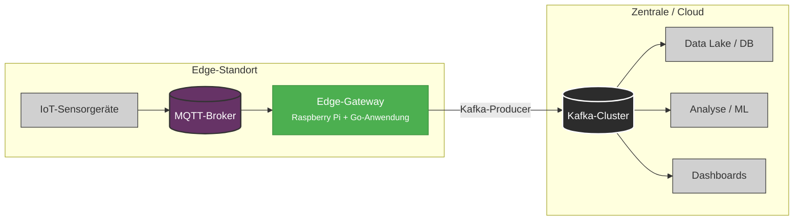

# 🌐 Intelligenz am Netzwerkrand (Edge): IoT Datenaggregations & Verarbeitungs-Gateway

> **Ein robustes Edge Computing-Gateway, entwickelt auf einem Raspberry Pi mit Go**  
> Dieses Projekt implementiert eine intelligente, resiliente Datenvorverarbeitung am Netzwerkrand, um Bandbreite zu reduzieren, die Datenqualität zu verbessern und einen zuverlässigen Telemetriefluss von IoT-Sensoren zu Cloud-Analysen über Kafka zu ermöglichen.

---

## 🔍 Projektübersicht

In modernen IoT Systemen führt das direkte Senden von Rohdaten von Sensoren in die Cloud zu **hoher Bandbreitennutzung**, **Latenzengpässen** und **erhöhten Betriebskosten**. Dieses Projekt löst dieses Problem mit einem **intelligenten Edge-Gateway**, das auf einem **Raspberry Pi** läuft und in **Go (Golang)** geschrieben ist, um hohe Leistung, Parallelität und Effizienz zu gewährleisten.

Das Gateway:
- 📥 **Erfasst** Echtzeit-Sensordaten über **MQTT**
- 💾 **Puffert** Daten lokal während Netzwerkausfällen
- 🧹 **Filtert, aggregiert und reichert** Daten am Edge an
- 🚀 **Leitet bereinigte, hochwertige Daten** an **Apache Kafka** für nachgelagerte Analysen weiter

Indem die „Intelligenz“ an den Rand des Netzwerks verlagert wird, ermöglicht diese Lösung:
- ✅ Bis zu **98 % Reduzierung des Datenvolumens**
- ✅ **Kein Datenverlust** bei unterbrochener Konnektivität
- ✅ **Lokale Verarbeitung mit geringer Latenz**
- ✅ **Skalierbare Integration** mit Echtzeit Analysen, Data Lakes oder ML Pipelines

Perfekt für **industrielle Überwachung**, **Smart Environment Systeme** oder **Fernerkundungsinfrastrukturen**.

---

## 🧩 Kernfunktionen

✅ **MQTT-Subscriber** – Echtzeit-Erfassung von IoT-Sensoren über Topics wie `sensors/+/data`  
✅ **Resiliente lokale Pufferung** – Eine festplattenbasierte SQLite-Warteschlange stellt die Datensicherheit bei Ausfällen sicher  
✅ **Konfigurierbare Datenverarbeitung** – Filtern von Rauschen, Aggregieren von Werten (z. B. durchschnittliche Temperatur pro Minute), Anreichern mit Metadaten  
✅ **Kafka-Producer-Integration** – Zuverlässige Zustellung an einen zentralen Kafka-Cluster mit `confluent-kafka-go`  
✅ **Fehlertolerantes Design** – Exponentielles Backoff bei Wiederholungsversuchen, automatische Wiederverbindung, Deduplizierung von Nachrichten  
✅ **Leichtgewichtig & Effizient** – In Go entwickelt: eine statische Binärdatei, minimaler CPU-/Speicherverbrauch  
✅ **YAML-Konfiguration** – Menschenlesbare, leicht anpassbare Regeln für Topics, Filter, Schwellenwerte und Intervalle  
✅ **Strukturiertes Logging** – Protokollierung mit Zap für Debugging und Betrieb

---

## 🏗️ Systemarchitektur

Dieses Gateway befindet sich zwischen lokalen IoT-Geräten und einem zentralen Analyse-Backend:



### Warum Edge-Verarbeitung wichtig ist

| Herkömmlicher Ansatz | ✅ Dieses Gateway |
|----------------------|----------------|
| Sensoren → Rohdaten → Cloud → Verarbeitung | Sensoren → Bereinigte/Aggregierte Daten → Cloud → Analyse |
| Hohe Bandbreitenkosten | Drastisch reduzierter Datenfluss |
| Anfällig für Netzwerkprobleme | Lokale Pufferung sichert vor Datenverlust |
| Cloud trägt die gesamte Verarbeitungslast | Edge übernimmt Filterung & Aggregation |

Eine Edge-First-Verarbeitung ist **entscheidend für Skalierbarkeit, Kosteneffizienz und Zuverlässigkeit**.

---

## 🛠️ Tech Stack

| Ebene            | Technologie                                  |
|------------------|----------------------------------------------|
| **Hardware**     | Raspberry Pi 4/5 (ARM64) oder jedes Linux Gerät |
| **Sprache**      | Go (Golang) 1.21+                             |
| **MQTT Client**  | Eclipse Paho Go MQTT                          |
| **Kafka Client** | Confluent Kafka Go (`confluent kafka go`)     |
| **Speicher**     | SQLite (festplattenbasierte Pufferung)        |
| **Konfiguration**| YAML + Viper                                  |
| **Logging**      | Zap (strukturiertes, levelbasiertes Logging)  |
| **Build Tool**   | Makefile + Go Module                          |
| **Deployment**   | systemd Dienst (empfohlen) oder `nohup`      |

  
  
  
  


---

## 🚀 Erste Schritte

### Voraussetzungen

- ✅ Raspberry Pi (4 oder 5 empfohlen) mit Raspberry Pi OS Lite
- ✅ Go 1.21+ installiert (`go version`)
- ✅ Lokaler MQTT-Broker (z. B. Mosquitto)
- ✅ Zugriff auf einen Kafka-Cluster (lokal oder remote)
- ✅ Grundlegende Linux-Kommandozeilenkenntnisse

---

### 1. Repository klonen

```bash
git clone https://github.com/your-username/intelligence-at-the-edge.git
cd intelligence-at-the-edge
```

---

### 2. Abhängigkeiten installieren

```bash
go mod tidy
```

---

### 3. Gateway konfigurieren

Bearbeiten Sie `config/config.yaml`, um sie an Ihre Umgebung anzupassen:

```yaml
mqtt:
  broker: "tcp://192.168.1.100:1883"
  client_id: "edge-gateway-01"
  topic: "sensors/#"
  qos: 1

kafka:
  brokers:
    - "kafka1.internal:9092"
    - "kafka2.internal:9092"
  topic: "iot-sensor-data"
  client_id: "edge-producer"

buffer:
  path: "./data/buffer.db"
  max_size_mb: 100
  flush_interval_seconds: 30

processing:
  aggregation_window_seconds: 60
  rules:
    - type: "filter"
      field: "temperature"
      operator: "<"
      value: -50
      action: "drop"
    - type: "filter"
      field: "temperature"
      operator: ">"
      value: 100
      action: "drop"
    - type: "aggregate"
      field: "temperature"
      function: "average"
      output_name: "avg_temp"
    - type: "aggregate"
      field: "humidity"
      function: "avg"
      output_name: "avg_humidity"

logging:
  level: "info"
  output: "file"
  file: "./logs/gateway.log"
```

> 💡 Tipp: Diese Konfiguration filtert physikalisch unmögliche Temperaturen heraus und sendet eine aggregierte Nachricht pro Minute anstelle von Rohdaten pro Sekunde.

---

### 4. Binärdatei erstellen

```bash
make build
```

> Wenn Sie `make` nicht installiert haben, verwenden Sie:  
> `go build -o bin/edge-gateway cmd/gateway/main.go`

---

### 5. Gateway ausführen

#### Option A: Manueller Start (Testen)

```bash
./bin/edge-gateway --config config/config.yaml
```

Drücken Sie `Ctrl+C` zum Beenden.

#### Option B: Als Systemd-Dienst ausführen (Produktion)

```bash
sudo make install-service
sudo systemctl enable edge-gateway
sudo systemctl start edge-gateway
```

Status überprüfen:
```bash
sudo systemctl status edge-gateway
journalctl -u edge-gateway.service -f
```

---

### 6. Datenfluss testen

1. **Beispieldaten an MQTT senden:**

```bash
mosquitto_pub -h 192.168.1.100 -t "sensors/device01/data" -m \
'{"temperature": 23.5, "humidity": 55, "timestamp": "2025-04-05T12:00:00Z"}'
```

2. **Kafka-Topic überwachen:**

```bash
kafka-console-consumer.sh --bootstrap-server kafka1:9092 \
--topic iot-sensor-data --from-beginning
```

Sie sollten Folgendes sehen:
```json
{
  "location": "site-a",
  "avg_temp": 23.8,
  "avg_humidity": 57.2,
  "samples": 60,
  "window_start": "2025-04-05T12:00:00Z",
  "gateway_id": "edge-gateway-01"
}
```

---

## 📊 Auswirkungen: Reduzierung des Datenvolumens

| Ansatz | Nachrichten/Minute | Gesamt über 24h |
|--------|------------------|----------------|
| Rohdaten (pro Sensor) | 60 | 86.400 |
| **Edge-aggregiert** | **1** | **1.440** |
| ✅ **Reduzierung** |  | **~98 %+** |

Dies reduziert direkt die Cloud-Kosten, die Kafka-Last und die Netzwerkbelastung.

---

## 🔄 Resilienz & Fehlertoleranz

Das Gateway stellt **null Datenverlust** unter instabilen Bedingungen sicher:

| Szenario | Verhalten |
|--------|---------|
| Netzwerkausfall | Daten werden in SQLite gepuffert (`data/buffer.db`) |
| Kafka nicht verfügbar | Wiederholungsversuche mit exponentiellem Backoff |
| Stromausfall | SQLite speichert persistent; Fortsetzung nach Neustart |
| Nachrichtenduplikate | Idempotentes Design vermeidet doppeltes Senden |

> ⚠️ Verlieren Sie nie wieder kritische Sensortelemetrie.

---

## 🗂️ Repository-Struktur

```
intelligence-at-the-edge/
├── cmd/
│   └── gateway/
│       └── main.go                 # Einstiegspunkt
├── internal/
│   ├── mqtt/                       # Behandelt MQTT-Abonnements
│   ├── buffer/                     # SQLite-Warteschlange mit Persistenz
│   ├── processor/                  # Filtert, aggregiert, reichert an
│   ├── kafka/                      # Wrapper für den Kafka-Producer
│   ├── config/                     # Viper-basierter Konfigurationslader
│   └── logger/                     # Einrichtung für strukturiertes Logging
├── config/
│   └── config.yaml                 # Standardkonfiguration
├── data/                           # (In .gitignore) SQLite-Speicher
├── logs/                           # (In .gitignore) Log-Dateien
├── bin/                            # (In .gitignore) Kompilierte Binärdatei
├── Makefile                        # Helfer für Build, Ausführung, Deployment
├── go.mod
├── go.sum
└── README.md
```

---

## 🧠 Intelligente Datenverarbeitung

Das `processor`-Paket wendet konfigurierbare Regeln an:

```yaml
rules:
  - type: "filter"
    field: "quality_score"
    operator: "<"
    value: 0.7
    action: "drop"
  - type: "aggregate"
    field: "vibration"
    function: "avg"
    window_seconds: 60
```

Unterstützte Funktionen:
- **Filtern**: Ungültige oder irrelevante Daten verwerfen
- **Aggregieren**: Durchschnitt / Summe / Min / Max über ein Zeitfenster
- **Anreichern**: Gateway-ID, Standort, Zeitstempel, abgeleitete Felder hinzufügen
- **Transformieren**: Einheiten umrechnen, Formate standardisieren

---

## 🚧 Zukünftige Erweiterungen

- 🔮 **Edge AI/ML**: TinyML-Modelle zur Anomalieerkennung ausführen
- 🖥️ **Lokales Dashboard**: Leichtgewichtige Web-UI mit Gin oder Echo
- 🌐 **Unterstützung mehrerer Protokolle**: CoAP, HTTP oder Modbus-Eingänge hinzufügen
- 🔐 **Sicherheit**: TLS, mTLS, JWT-Authentifizierung für MQTT/Kafka
- 🧾 **OTA-Konfiguration**: Regeln dynamisch über MQTT-Befehle aktualisieren
- 📈 **Metrik-Export**: Prometheus-Endpunkt + Grafana-Dashboards

---

## 🤝 Mitwirken

Beiträge sind **herzlich willkommen**!

Sie können helfen durch:
- ✅ Hinzufügen neuer Verarbeitungsregeln (z. B. Ausreißererkennung)
- ✅ Verbesserung der Fehlerbehandlung und Beobachtbarkeit (Observability)
- ✅ Hinzufügen von Sicherheitsfunktionen (TLS, Authentifizierung)
- ✅ Schreiben von Integrationstests
- ✅ Erstellen von Docker/Podman-Unterstützung
- ✅ Erstellen von Deployment-Skripten (Ansible, Terraform)

👉 Eröffnen Sie ein Issue oder senden Sie eine PR!

---

## 📚 Lernerfolge

Dieses Projekt vermittelt fortgeschrittene Konzepte in:
- 🖥️ Parallele Programmierung mit Go (Goroutinen, Channels)
- 📡 Ereignisgesteuerte Architekturen mit MQTT
- 💡 Stream-Verarbeitung und Datenaggregation
- 🧱 Datenpersistenz auf ressourcenbeschränkten Edge-Geräten
- 🔄 Integration mit Kafka für skalierbare Datenpipelines
- 🔋 Systemresilienz-Muster (Pufferung, Wiederholungsversuche, Idempotenz)
- 🛠️ DevOps: Logging, Monitoring, Deployment

Ideal für Entwickler, die auf Positionen in den Bereichen **IoT**, **Cloud-native Systeme**, **Data Engineering** oder **Edge AI** abzielen.

---

## 🗃️ Lizenz

MIT-Lizenz – siehe [LICENSE](LICENSE) für Details.
